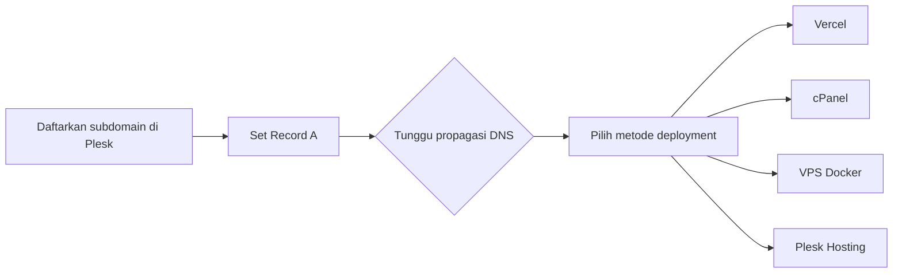

# Panduan Deployment

> Standar deployment proyek Webekspres ke **Vercel**, **cPanel (Arvacloud)**, **VPS (SSH + Docker)**, dan **Plesk (IDCloudHost)**.
>
> **Domain demo:** `(namadomain).webekspres.web.id`

**Dokumen terkait:** [README](README.md) · [Panduan Kontribusi](CONTRIBUTING.md) · [Keamanan](SECURITY.md) · [Dukungan](SUPPORT.md)

---

## Ringkasan

| Metode | Cocok untuk | DNS Record A |
|--------|-------------|--------------|
| [Vercel](#deployment-ke-vercel) | Next.js, React, static/SSR | `76.76.21.21` |
| [cPanel](#deployment-ke-cpanel) | PHP, WordPress, project tanpa Docker | IP VPS cPanel |
| [VPS + Docker](#deployment-ke-vps-ssh--docker) | Aplikasi containerized | IP VPS SSH |
| [Plesk](#deployment-ke-plesk-idcloudhost-shared-hosting) | Laravel, PHP (LiteSpeed) | Sesuai hosting |

> **Urutan wajib:** Daftarkan subdomain di [Plesk](#konfigurasi-domain-via-plesk) **terlebih dahulu** sebelum deployment ke metode manapun.



---

## Daftar Isi

1. [Konfigurasi Domain via Plesk](#konfigurasi-domain-via-plesk)
2. [Deployment ke Vercel](#deployment-ke-vercel)
3. [Deployment ke cPanel](#deployment-ke-cpanel)
4. [Deployment ke VPS (SSH + Docker)](#deployment-ke-vps-ssh--docker)
   - [Manajemen Wildcard SSL](#manajemen-wildcard-ssl-certificate)
5. [Deployment ke Plesk (IDCloudHost)](#deployment-ke-plesk-idcloudhost-shared-hosting)
   - [Troubleshooting Plesk](#troubleshooting-umum-plesk)
   - [Checklist Deploy Laravel](#checklist-deploy-laravel-ke-plesk)
6. [Referensi Cepat](#referensi-cepat)

---

## Konfigurasi Domain via Plesk

Langkah ini **wajib dilakukan pertama** sebelum deployment ke Vercel, cPanel, maupun VPS SSH.

### 1. Login ke Plesk

- Buka panel Plesk yang digunakan
- Login dengan akun yang tersedia

### 2. Tambahkan Subdomain

- Buka **Websites & Domains** → **Add Subdomain**
- Isi nama subdomain: `(namadomain).webekspres.web.id` *(format wajib)*
- Klik **OK**

### 3. Enable DNS & Edit Record A

- Masuk ke pengaturan subdomain yang baru dibuat
- Klik **DNS Settings** / **Enable DNS**
- Edit **Record A** sesuai target deployment:

| Target | IP Address |
|--------|------------|
| Vercel | `76.76.21.21` |
| cPanel | IP VPS cPanel — cek dengan `curl ifconfig.me` di terminal cPanel |
| VPS SSH | IP VPS SSH — cek dengan `curl ifconfig.me` di terminal VPS |

### 4. Tunggu Propagasi DNS

- Biasanya **5–30 menit**
- Verifikasi di [dnschecker.org](https://dnschecker.org)
- Setelah selesai, lanjut ke metode deployment yang dipilih

---

## Deployment ke Vercel

### Prasyarat

- Akses akun Vercel: `mk.webekspres@gmail.com` (login via Google)
- Repository sudah tersedia di GitHub
- [DNS subdomain sudah aktif](#konfigurasi-domain-via-plesk)

### Langkah-langkah

**1. Login ke Vercel**

Buka [vercel.com](https://vercel.com) → login dengan Google (`mk.webekspres@gmail.com`).

**2. Import Project dari GitHub**

- **Add New → Project**
- Pilih repository → **Import**

**3. Set Environment Variables**

- Buka tab **Environment Variables**
- Tambahkan semua variabel `.env` yang dibutuhkan
- **Deploy**

> Jangan commit file `.env` ke Git. Lihat [Kebijakan Keamanan](SECURITY.md).

**4. Tambahkan Custom Domain**

- **Settings → Domains**
- Masukkan: `(namadomain).webekspres.web.id`
- **Verify** — berhasil setelah propagasi DNS Plesk selesai

---

## Deployment ke cPanel

### Prasyarat

- Akses cPanel: [tiga.arvacloud.com:2083](https://tiga.arvacloud.com:2083/)
- Repository di GitHub dengan **Personal Access Token (Classic)**
- File `.cpanel.yaml` di root project
- [DNS subdomain sudah aktif](#konfigurasi-domain-via-plesk)

### Langkah-langkah

**1. Login ke cPanel**

Buka [tiga.arvacloud.com:2083](https://tiga.arvacloud.com:2083/) dan masukkan kredensial.

**2. Tambahkan Domain**

- **Domains → Create A New Domain**
- Subdomain: `(namadomain).webekspres.web.id` → **Submit**

**3. Verifikasi DNS**

Pastikan subdomain terdaftar di Plesk dan Record A mengarah ke IP VPS cPanel. Cek di [dnschecker.org](https://dnschecker.org).

**4. Buat `.cpanel.yaml` di Root Project**

Jika belum ada:

```yaml
---
deployment:
  tasks:
    - export DEPLOYPATH=/home/webekspr/public_html/NAMADOMAIN.webekspres.web.id
    - /bin/cp -R * $DEPLOYPATH
```

> Ganti `NAMADOMAIN` sesuai subdomain. Commit dan push ke GitHub.

**5. Pull Repository via Git Version Control**

- **Git™ Version Control → Create**
- URL repository (sertakan GitHub Token Classic):
  ```
  https://<TOKEN>@github.com/username/nama-repo.git
  ```
- Isi **Repository Path** → **Create** → **Update** / **Deploy**

**6. Buat Database & User**

- **MySQL Databases** → buat database dan user
- Berikan hak akses **ALL PRIVILEGES**
- Catat kredensial untuk `.env`

**7. Buat File `.env` via File Manager**

- Navigasi ke `/public_html/(namadomain).webekspres.web.id/`
- Buat file `.env` → isi environment variables → **Save**

**8. Aktifkan SSL**

- **SSL/TLS → Run SSL Wizard** atau **Manage SSL Sites**
- Pasang SSL untuk `(namadomain).webekspres.web.id`

**9. Verifikasi**

Akses `https://(namadomain).webekspres.web.id` — pastikan live dan SSL aktif.

---

## Deployment ke VPS (SSH + Docker)

### Arsitektur

```
Internet
    │
  Host Nginx (port 80/443) — SSL termination
    │
    └── Reverse proxy → Container (port internal, HTTP only)
```

SSL di-terminate di host nginx. Container hanya HTTP internal — tidak perlu SSL di dalam container.

### Prasyarat

- Akses SSH: port **8288**
- Docker CE + Docker Compose Plugin terinstal
- Host nginx aktif
- Wildcard SSL `*.webekspres.web.id` sudah di-issue → lihat [Manajemen Wildcard SSL](#manajemen-wildcard-ssl-certificate)
- `Dockerfile` dan `docker-compose.yml` ada di project
- [DNS subdomain sudah aktif](#konfigurasi-domain-via-plesk)

### Langkah-langkah

**1. Verifikasi DNS**

```bash
ssh -p 8288 adminweb@IP_VPS
curl ifconfig.me
```

Konfirmasi propagasi di [dnschecker.org](https://dnschecker.org).

**2. Upload Project ke VPS**

Via SCP:

```bash
scp -P 8288 -r nama-project/ adminweb@IP_VPS:/opt/nama-project/
```

Atau clone di VPS:

```bash
ssh -p 8288 adminweb@IP_VPS
git clone https://github.com/username/nama-repo.git /opt/nama-project/
```

> Semua project Docker disimpan di `/opt/`.

**3. Buat File `.env`**

```bash
ssh -p 8288 adminweb@IP_VPS
cd /opt/nama-project/
nano .env
```

Pastikan:
- `APP_URL=https://namadomain.webekspres.web.id`
- Kredensial database sesuai `docker-compose.yml`

**4. Container Nginx — HTTP Only**

Di dalam container, nginx hanya listen port 80:

```nginx
server {
    listen 80;
    server_name namadomain.webekspres.web.id;
    # ... konfigurasi lainnya
}
```

Di `docker-compose.yml`:

```yaml
ports:
  - "8081:80"
```

> Pilih port host yang belum dipakai. Catat untuk konfigurasi host nginx.

**5. Jalankan Container**

```bash
cd /opt/nama-project/
docker compose up -d --build
docker compose ps
```

Jika ada service `Exit`:

```bash
docker compose logs nama-service
```

**6. Konfigurasi Host Nginx (Reverse Proxy)**

```bash
sudo nano /etc/nginx/sites-available/nama-project
```

```nginx
server {
    listen 80;
    server_name namadomain.webekspres.web.id;

    location /.well-known/acme-challenge/ {
        root /var/www/certbot;
    }

    location / {
        return 301 https://$host$request_uri;
    }
}

server {
    listen 443 ssl;
    server_name namadomain.webekspres.web.id;

    ssl_certificate     /etc/letsencrypt/live/webekspres.web.id/fullchain.pem;
    ssl_certificate_key /etc/letsencrypt/live/webekspres.web.id/privkey.pem;

    location / {
        proxy_pass http://127.0.0.1:PORT_CONTAINER;

        proxy_set_header Host              $host;
        proxy_set_header X-Forwarded-Proto $scheme;
        proxy_set_header X-Forwarded-For   $proxy_add_x_forwarded_for;
        proxy_set_header X-Real-IP         $remote_addr;
    }
}
```

> Ganti `PORT_CONTAINER` (contoh: `8081`). Path SSL menggunakan wildcard cert.

Aktifkan dan reload:

```bash
sudo ln -s /etc/nginx/sites-available/nama-project /etc/nginx/sites-enabled/
sudo nginx -t
sudo systemctl reload nginx
```

**7. Verifikasi**

- Akses `https://namadomain.webekspres.web.id`
- HTTPS aktif, konten tampil benar
- Tidak ada mixed content di browser console

---

### Manajemen Wildcard SSL Certificate

Wildcard cert `*.webekspres.web.id` berlaku untuk semua subdomain. Di-issue sekali, dipakai seluruh konfigurasi nginx di host.

#### Issue Wildcard Cert (satu kali setup)

```bash
sudo certbot certonly \
  --manual \
  --preferred-challenges dns \
  -d "*.webekspres.web.id" \
  -d "webekspres.web.id"
```

Certbot meminta **DNS TXT record** di Plesk. Tambahkan record, tunggu propagasi (~5 menit), lalu lanjutkan.

Cert tersimpan di:

```
/etc/letsencrypt/live/webekspres.web.id/fullchain.pem
/etc/letsencrypt/live/webekspres.web.id/privkey.pem
```

#### Cek Validitas Cert

```bash
sudo certbot certificates
```

Output sehat:

```
Certificate Name: webekspres.web.id
  Domains: *.webekspres.web.id webekspres.web.id
  Expiry Date: 2025-08-01 (VALID: 89 days)
```

Jika `INVALID` atau `EXPIRED`:

```bash
sudo journalctl -u certbot
sudo certbot renew --force-renewal
sudo systemctl reload nginx
```

Cek cepat via endpoint:

```bash
echo | openssl s_client -connect namadomain.webekspres.web.id:443 \
  -servername namadomain.webekspres.web.id 2>/dev/null | openssl x509 -noout -dates
```

#### Auto-renew

```bash
sudo systemctl status certbot.timer
```

Wildcard cert dengan DNS challenge tidak bisa fully-automatic. Cek manual minimal sebulan sekali dengan `sudo certbot certificates`.

---

## Deployment ke Plesk (IDCloudHost Shared Hosting)

> Cocok untuk Laravel dan PHP umumnya. Web server: **LiteSpeed + FastCGI**.

### Prasyarat

- Akses SSH ke server Plesk
- Akses Plesk panel domain
- PHP 8.x tersedia

### Catatan: PHP CLI vs PHP Web

PHP versi web (panel) dan CLI (SSH) bisa berbeda. Selalu gunakan path eksplisit:

```bash
/opt/plesk/php/8.3/bin/php artisan migrate
/opt/plesk/php/8.3/bin/php /opt/plesk/php/8.3/bin/composer install
```

Cek versi tersedia:

```bash
plesk bin php_handler --list
find /opt/plesk/php -name "php" -type f
```

### Langkah-langkah

**1. Upload File Project**

Upload ke direktori domain (default IDCloudHost):

```
/DATA/vhosts/[subscription]/[domain]/
```

File project (`artisan`, `composer.json`, `app`, `public`, dll.) langsung di direktori ini — bukan subfolder `httpdocs`.

**2. Hapus File Placeholder**

```bash
rm /DATA/vhosts/[subscription]/[domain]/index.html
```

**3. Set Document Root ke `/public`**

Plesk panel: **[domain] → Hosting & DNS → Hosting Settings → Document root**

```
[domain]/public
```

**4. Set Versi PHP**

**[domain] → PHP → PHP version** — minimal 8.1 untuk Laravel 10+.

Mode: **FastCGI application** (bukan CGI biasa).

**5. Nonaktifkan Node.js Handler**

Jika ada `package.json`, LiteSpeed bisa mendeteksi sebagai Node.js app → 503.

Gejala di `stderr.log`:
```
Error: Cannot find module '.../app.js'
```

Fix: **[domain] → Dashboard → Node.js → Disable**

**6. Install Dependencies**

```bash
cd /DATA/vhosts/[subscription]/[domain]/
/opt/plesk/php/8.3/bin/php /opt/plesk/php/8.3/bin/composer install --no-dev --optimize-autoloader
```

**7. Konfigurasi `.env`**

```env
APP_URL=https://[domain]
APP_ENV=production
APP_DEBUG=false

DB_HOST=127.0.0.1
DB_PORT=3306
DB_DATABASE=[nama_database]
DB_USERNAME=[user_database]
DB_PASSWORD=[password]
```

Database: **[domain] → Databases → Add Database**

**8. Generate Key & Migrate**

```bash
/opt/plesk/php/8.3/bin/php artisan key:generate
/opt/plesk/php/8.3/bin/php artisan migrate --force
```

**9. Setup Storage Symlink**

```bash
/opt/plesk/php/8.3/bin/php artisan storage:link
```

Recreate sebagai relative path (LiteSpeed memblokir symlink absolute):

```bash
cd /DATA/vhosts/[subscription]/[domain]/public
rm storage
ln -s ../storage/app/public storage
```

**10. Izinkan FollowSymLinks**

**[domain] → Apache & nginx Settings** → uncheck **"Restrict the ability to follow symbolic links"**

> Diterapkan server dalam ~30 menit.

**11. Set Permissions**

```bash
chmod -R 775 /DATA/vhosts/[subscription]/[domain]/storage
chmod -R 775 /DATA/vhosts/[subscription]/[domain]/bootstrap/cache
find /DATA/vhosts/[subscription]/[domain]/storage/app/public -type f -exec chmod 644 {} \;
find /DATA/vhosts/[subscription]/[domain]/storage/app/public -type d -exec chmod 755 {} \;
```

**12. SSL**

**[domain] → SSL/TLS Certificates → Let's Encrypt** → aktifkan redirect HTTP → HTTPS.

**13. Clear Cache**

```bash
/opt/plesk/php/8.3/bin/php artisan config:clear
/opt/plesk/php/8.3/bin/php artisan cache:clear
/opt/plesk/php/8.3/bin/php artisan view:clear
/opt/plesk/php/8.3/bin/php artisan route:clear
```

**14. Verifikasi**

```bash
/opt/plesk/php/8.3/bin/php artisan about
```

---

### Troubleshooting Umum Plesk

#### 503 Service Unavailable

```bash
cat /DATA/vhosts/[subscription]/[domain]/stderr.log
```

Jika `Cannot find module app.js` → disable Node.js handler di panel.

#### 403 Forbidden pada `storage/`

1. "Restrict symbolic links" masih aktif → uncheck di Apache & nginx Settings
2. Permissions salah → jalankan `chmod` dari langkah 11

#### Mixed Content (HTTP asset di halaman HTTPS)

URL lama di database (setelah import dump local):

```bash
/opt/plesk/php/8.3/bin/php artisan tinker --execute="
DB::statement(\"UPDATE [nama_tabel] SET [kolom] = REPLACE([kolom], 'http://127.0.0.1:8000', 'https://[domain]') WHERE [kolom] LIKE '%127.0.0.1:8000%'\");
echo 'done';
" 2>&1
```

#### PHP CLI versi lama

```bash
php -v
/opt/plesk/php/8.3/bin/php artisan [command]
```

---

### Checklist Deploy Laravel ke Plesk

- [ ] Upload file project ke direktori domain
- [ ] Hapus `index.html` placeholder
- [ ] Set Document root ke `[domain]/public`
- [ ] Set PHP version (FastCGI mode)
- [ ] Disable Node.js handler jika aktif
- [ ] `composer install --no-dev`
- [ ] Buat/edit `.env` — `APP_URL` ke domain production
- [ ] `php artisan key:generate`
- [ ] Buat database via Plesk panel
- [ ] `php artisan migrate --force`
- [ ] `php artisan storage:link` + relative symlink
- [ ] Uncheck "Restrict symbolic links" (tunggu ~30 menit)
- [ ] Set permissions `storage` dan `bootstrap/cache`
- [ ] Issue SSL via Let's Encrypt
- [ ] Clear semua cache
- [ ] Jika import DB dari local: jalankan REPLACE query untuk fix URL

---

## Referensi Cepat

| Item | Nilai |
|------|-------|
| Format domain demo | `(namadomain).webekspres.web.id` |
| GitHub Token (cPanel) | Personal Access Token **Classic** |
| File `.cpanel.yaml` | Wajib di root sebelum pull di cPanel |
| IP Vercel | `76.76.21.21` |
| IP cPanel / VPS | `curl ifconfig.me` di terminal masing-masing |
| cPanel Login | [tiga.arvacloud.com:2083](https://tiga.arvacloud.com:2083/) |
| Vercel Login | `mk.webekspres@gmail.com` via Google |
| SSH Port VPS | `8288` |
| Lokasi project VPS | `/opt/(nama-project)/` |
| SSL VPS | Wildcard `*.webekspres.web.id` |
| Cek cert VPS | `sudo certbot certificates` (minimal bulanan) |
| PHP CLI Plesk | `/opt/plesk/php/[versi]/bin/php` |
| Web server Plesk | LiteSpeed + FastCGI |
| Lokasi project Plesk | `/DATA/vhosts/[subscription]/[domain]/` |

---

<div align="center">

**PT Webekspres Teknologi Indonesia**

[Kembali ke README](README.md) · [Panduan Kontribusi](CONTRIBUTING.md) · [Dukungan](SUPPORT.md)

</div>
